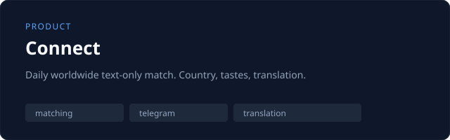
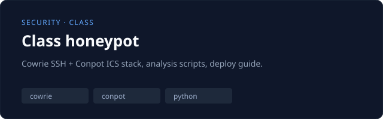
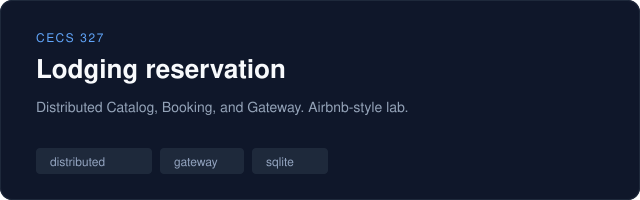

  

  I design and build systems that stay on your machine when they can, 
  and split cleanly across services when they have to.

  <a href="https://github.com/ungleicch?tab=repositories">Repositories</a>
  ·
  <a href="https://github.com/ungleicch/connect">Connect</a>
  ·
  <a href="https://github.com/ungleicch/class-honeypot">Honeypot</a>
  ·
  <a href="https://github.com/ungleicch/CECS-327-Sec02-Distributed-lodging-reservation">Lodging</a>

---

### Selected work

<table>
<tr>
<td width="50%">
  
</td>
<td width="50%">
  
</td>
</tr>
<tr>
<td width="50%">
  
</td>
<td width="50%" valign="middle">

**Also in private repos**

Local AI chat (agents, tools, characters), a macOS AI wardrobe studio, a family-tree site, and StudyForge.

Happy to walk through any of it.

</td>
</tr>
</table>

### How I work

| | |
|---|---|
| **Local-first** | Desktop and LAN tools that do not need a cloud account to be useful |
| **Distributed** | Clear service boundaries, honest failure models, boring transports |
| **Applied AI** | Agents and translation in real products, not notebook demos |

### Currently

Building **Connect** (daily worldwide text chat) and the CECS 327 **lodging reservation** system — Catalog, then Gateway, then Booking, documented with course vocabulary.

 

  Los Angeles · CSULB · <a href="https://github.com/ungleicch">ungleicch</a>

